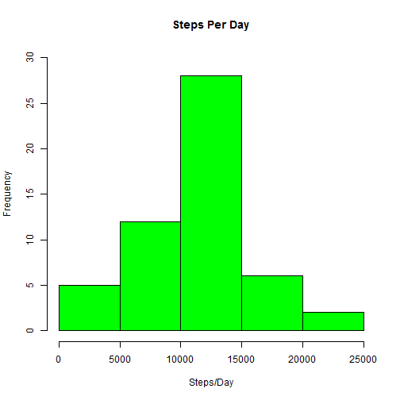
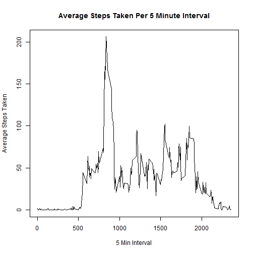
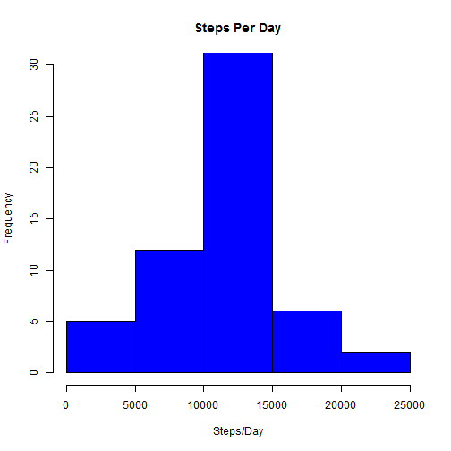
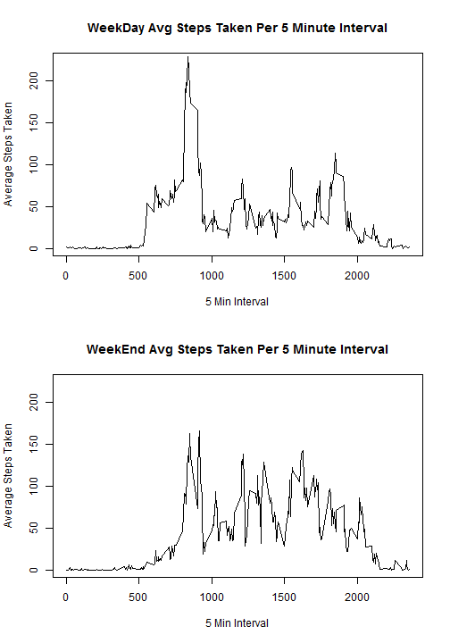

Reproducible Research - Project 1
=========================

## Code for reading in the dataset and processing.

## Load the data and remove NAs.

```r
if(!file.exists("./data")){dir.create("./data")}
# unzip file
# unzip("./data/repdata_data_activity.zip",exdir = "./data")
Raw <- read.csv("./data/activity.csv")
Activity <- na.omit(Raw)
```
## Histogram of total number of steps taken per day.

```r
# Calculate the total number of steps taken daily
TotalStepsPerDay <- tapply(Activity$steps, Activity$date, FUN = sum)
# Make Histogram of total number of steps taken each day.
hist(TotalStepsPerDay,
     main = "Steps Per Day",
     xlab = "Steps/Day",
     ylab = "Frequency",
     col = "green",
     ylim = c(0,30))
```



## Mean and median number of steps taken each day.

```r
MeanStepsDay <- mean(TotalStepsPerDay, na.rm = TRUE)
MedianStepsDay <- median(TotalStepsPerDay, na.rm = TRUE)
```
The average number of steps is 1.0766189 &times; 10<sup>4</sup>.

The median number of steps is 10765.


## Time series plot of the average number of steps taken.

```r
# Calculate the 5 min averages over all days
FiveMinAvgs <- tapply(Activity$steps, Activity$interval, FUN = mean, na.rm = TRUE)
Intervals = Activity$interval[1:288]
plot(Intervals,FiveMinAvgs,
     main = "Average Steps Taken Per 5 Minute Interval",
     ylab = "Average Steps Taken",
     xlab = "5 Min Interval",
     type = "l")
```



## The 5-minute interval that on average contains the maximum number of steps.

```r
# Which 5 minute interval on average had the largest number of steps (the 104th 5 minute interval)
MaxSteps <- FiveMinAvgs[which.max(FiveMinAvgs)]
```
The 5 minute interval that contained the maximum number of steps on average was the 835th minute.

## Calculate the number of missing data points (NAs).

```r
NumNAs <- sum(is.na(Raw))
```
The number of missing data points in the data set is 2304

## Below is the code that was devised for imputing missing data.
## If an interval has missing data (NA), it replaces the NA with the average for the corresponding interval.

```r
NumObs <- dim(Raw)
RawNAsToAvg <- Raw
# Replace any NAs with the average of the corresponding interval
jj <- 1
for ( ii in 1:NumObs[1] ) {
  if ( ii %% length(FiveMinAvgs) != 0 ) {
    jj <- jj + 1
  } else {
    jj <- 1
  }
  if ( is.na(Raw[ii,1]) ) {
    RawNAsToAvg[ii,1] <- FiveMinAvgs[jj]
  }
}
```
## Histogram of the total number of steps taken each day after missing values are imputed.

```r
# Calculate the total number of steps taken daily for the new dataset
NewTotalStepsPerDay <- tapply(RawNAsToAvg$steps, RawNAsToAvg$date, FUN = sum)
# Make New Histogram of total number of steps taken each day.
hist(NewTotalStepsPerDay,
     main = "Steps Per Day",
     xlab = "Steps/Day",
     ylab = "Frequency",
     col = "blue",
     ylim = c(0,30))
```



## Mean and Median of the new data set.

```r
# Calculate the mean and median of number of steps per day.
NewMeanStepsDay <- mean(NewTotalStepsPerDay, na.rm = TRUE)
NewMedianStepsDay <- median(NewTotalStepsPerDay, na.rm = TRUE)
```
The average number of steps is 1.0766189 &times; 10<sup>4</sup>.

The median number of steps is 1.0766189 &times; 10<sup>4</sup>.

Imputing missing data into the data set resulted in the new data set having the same mean value as the old.

However, the median value slightly increased.

## Are there differences in activity patterns between weekdays and weekends?

```r
# Add factor column to new dataset that indicates "WeekDay" or "WeekEnd" 
RawNAsToAvg$DoW <- ifelse(weekdays(as.Date(RawNAsToAvg$date)) %in% c("Saturday","Sunday"), "WeekEnd","WeekDay")
```


```r
# get mean values for weekdays and weekends
a <- RawNAsToAvg$steps[RawNAsToAvg$DoW == "WeekDay"]
b <- RawNAsToAvg$interval[RawNAsToAvg$DoW == "WeekDay"]
c <- tapply(a,b,FUN = mean)

a1 <- RawNAsToAvg$steps[RawNAsToAvg$DoW == "WeekEnd"]
b1 <- RawNAsToAvg$interval[RawNAsToAvg$DoW == "WeekEnd"]
c1 <- tapply(a1,b1,FUN = mean)
```

## Panel plot comparing the average number of steps taken per 5-minute interval across weekdays and weekends.

```r
# Create panel plot to compare weekday steps and weekend steps
par(mfrow = c(2,1))
plot(Intervals,c,
     main = "WeekDay Avg Steps Taken Per 5 Minute Interval",
     ylab = "Average Steps Taken",
     xlab = "5 Min Interval",
     ylim = c(0,225),
     type = "l")
plot(Intervals,c1,
     main = "WeekEnd Avg Steps Taken Per 5 Minute Interval",
     ylab = "Average Steps Taken",
     xlab = "5 Min Interval",
     ylim = c(0,225),
     type = "l")
```



There are differences in the activity patterns for weekdays versus weekends. During the weekdays most of the activity appears to happen early in the day, with a small increase late in the day. On the weekends, the activity is fairly constant across the whole day.
